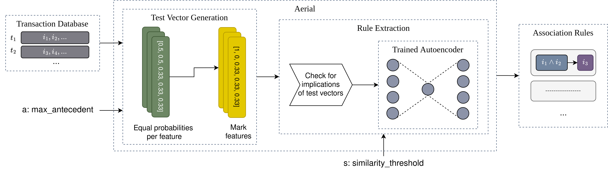

# Aerial: Learning and Extracting Logical Association Rules from Neural Representations

This repository contains the source code of the experiments described in the paper entitled 
"Aerial: Learning and Extracting Logical Association Rules from Neural Representations". 

## About

Aerial is a Deep Learning (DL)-based Association Rule Mining (ARM) approach for categorical
transaction databases that is developed to overcome big high-dimensional data handling issue
in state-of-the-art ARM. It consists two main steps: i) learning a neural representation of a given
transaction database, ii) extracting logical association rules from the representation. 

The first step is performed by training a denoising Autoencoder [1] with one-hot encoded version
of the transaction database. In its output layer, the Autoencoder has probability distribution
per input feature. For the second step, a pipeline of rule extraction operations of Aerial is 
described in the figure below:

The rule extraction step again receives the categorical transaction database as an input, 
together with a `max_antecedent` parameter (default value is set to 2). It creates a set of
so called `test vectors` according to the Algorithm 1 described in the paper. These test 
vectors include marked features. A forward run on the Autoencoder with the test vectors is 
carried out. If a set of features successfully reconstructed after the forward run, then 
we say that the marked features imply the reconstructed features, hence extracting logical
association rules from the neural representation. An example rule extraction is depicted in
the following figure:

In this example, there are two features (occupation and title) with 3 and 2 possible values 
each. The `max_antecedent` is set to 1, and a `similarity_threshold` is set to 80%. To test
whether `occupation(doctor)` implies one of the titles, the test vector of `[0, 1, 0, 0.5, 0.5]`
is created. Here, `occupation(doctor)` has the probability of 100% (1), and the other occupations
have 0% probability, while the possible set of titles have the equal probability of `0.5`. After
a forward run, gives the output vector of `[0.01, 0.97, 0.02, 0.85, 0.15]` in which `title(dr)`
has the probability of `0.85`, bigger than the `similarity_threshold`. Therefore, we say that
occupation being `doctor` implies the title `dr` and create the following logical association
rule: `occupation(doctor) -> title(dr)`.

## Datasets

The datasets used in the evaluation is taken from UCI ML Repository [2], which are categorical
datasets commonly used for ARM in the literature [3].

- [Hayes-Roth](https://archive.ics.uci.edu/dataset/44/hayes+roth)
- [Solar Flare](https://archive.ics.uci.edu/dataset/89/solar+flare)
- [Breast Cancer](https://archive.ics.uci.edu/dataset/14/breast+cancer)
- [Congressional Voting Records](https://archive.ics.uci.edu/dataset/105/congressional+voting+records)
- [Mushroom](https://archive.ics.uci.edu/dataset/73/mushroom)

Aerial is evaluated on these 5 datasets with exhaustive and optimization-based ARM algorithms.
The evaluation details and the results can be seen in the paper. The full results can also be found
in the [Results.xlsx](Results.xlsx) file.

The exhaustive algorithms are implemented using Mlxtend Python package [4], and the optimization-based
ARM algorithms are implemented using the NiaARM [5] and the NiaPY [6] Python packages. The DL-based
ARM-AE algorithm is taken from its original paper and source code [7].

## How to Run?

1. **Parameter configuration**: The `src/parameters.yaml` file contains all the parameters that Aerial and all other algorithms used as a baseline. These parameters should be set before execution.
- MIN_SUPPORT: minimum support threshold for the exhaustive algorithms
- MIN_CONFIDENCE: minimum confidence threshold for the exhaustive algorithms
- INIT_POPULATION_SIZE: initial population size for the optimization-based algorithms
- MAX_EVALS: maximum number of evaluations
- LIKENESS: used in similarity check of the ARM-AE algorithm
- NUMBER_OF_RULES: ARM-AE number of rules learned per consequent
- SIMILARITY_THRESHOLD: similarity threshold of the Aerial algorithm used in rule extraction
- NOISE_FACTOR: amount of added noise during the denoising Autoencoder training of Aerial method
- EPOCHS: number of epochs to train DL-based methods
- BATCH_SIZE: batch size to train DL-based methods
- LEARNING_RATE: learning rate to train DL-based methods
- NUMBER_OF_ANTECEDENTS: number of antecedents per rule for the DL-based methods

2. **Install requirements**: The Python requirements file is placed under `src` folder. 
Run the following to install all of the requirements: `pip3 install -r requirements.txt`.

3. **Running the experiments**: After setting the parameters, this can be done by simply executing
[`src/main.py`](src/main.py) file. The experiment results are both saved in a file named `results.csv`
and also printed on the terminal.

## How to Reuse?

The source code of Aerial can be found in [`src/algorithm/aerial`](src/algorithm/aerial), with the Autoencoder
implementation given in [`src/algorithm/aerial/autoencoder`](src/algorithm/aerial/autoencoder.py) and the rule extraction algorithm given 
in [`src/algorithm/aerial/aerial.py`](src/algorithm/aerial/aerial.py) file. 

The layer size and dimension can be (and should be) changed depending on the dataset used. In the `get_datasets()`
method of [`main.py`](src/main.py), the list of datasets on which the Aerial and baselines will be executed, can be set.

The Aerial class can easily be integrated with another code base together with its Autoencoder implementation (or others),
by copying the entire class.

Implementation for the exhaustive algorithms is given in [`src/algorithm/classic_arm.py`](src/algorithm/classic_arm.py) and the
implementation of the optimization-based ARM algorithms can be found in [`src/algorithm/optimization_arm.py`](src/algorithm/optimization_arm.py).

## References

[1] Pascal Vincent, Hugo Larochelle, Yoshua Bengio, and Pierre-Antoine Manzagol. 2008. Extracting and composing robust features with denoising autoencoders. In Proceedings of the 25th international conference on Machine learning. 1096–1103.

[2] Markelle Kelly, Rachel Longjohn, and Kolby Nottingham. 2023. The UCI machine learning repository. URL https://archive. ics. uci. edu (2023).

[3] Minakshi Kaushik, Rahul Sharma, Iztok Fister Jr, and Dirk Draheim. 2023. Numerical association rule mining: a systematic literature review. arXiv preprint arXiv:2307.00662 (2023).

[4] Sebastian Raschka. 2018. MLxtend: Providing machine learning and data science utilities and extensions to Python’s scientific computing stack. The Journal of Open Source Software 3, 24 (April 2018). https://doi.org/10.21105/joss.00638

[5] Žiga Stupan and Iztok Fister. 2022. Niaarm: a minimalistic framework for numerical association rule mining. Journal of Open Source Software 7, 77 (2022), 4448.

[6] Grega Vrbančič, Lucija Brezočnik, Uroš Mlakar, Dušan Fister, and Iztok Fister. 2018. NiaPy: Python microframework for building nature-inspired algorithms. Journal of Open Source Software 3, 23 (2018), 613.

[7] Berteloot, Théophile, Richard Khoury, and Audrey Durand. "Association Rules Mining with Auto-Encoders." arXiv preprint arXiv:2304.13717 (2023).